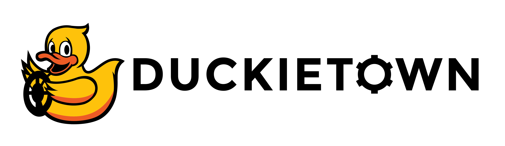
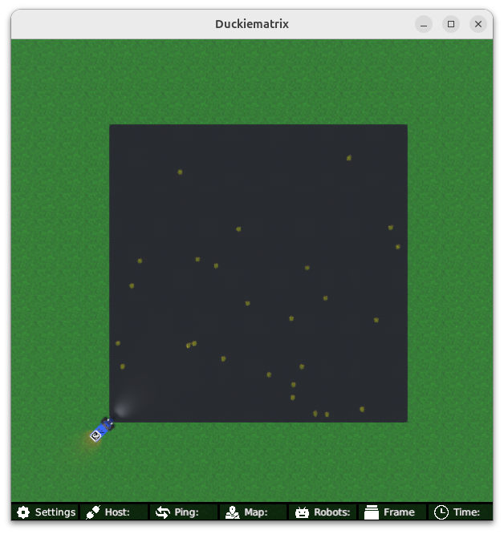

<p align="center">
<a href="https://duckietown.com"></a>
</p>

# **Learning Experience (LX): Braitenberg Vehicles**

# About these activities

Find the most up-to-date instructions on [how to run LXs on the Duckietown manual](https://docs.duckietown.com/ente/duckietown-manual/60-learning-experiences/lx-general-procedure.html). 

In this learning experience, you will learn [Braitenberg vehicles](https://en.wikipedia.org/wiki/Braitenberg_vehicle), one of the simplest possible
ways we could conceive of doing sensorimotor control. 

**NOTE:** All commands below are intended to be executed from the root directory of this exercise (i.e., the directory containing this README).

**(If not already done) Clone this repository**

The recommended way to use this repository is to make a fork and then clone that fork. 

This can be done through the GitHub web interface. However, you are also free to simply clone this repository and get started. 

**NOTE:** Example instructions to fork a repository and configure to pull from upstream can be found in the 
[duckietown-lx repository README](https://github.com/duckietown/duckietown-lx/blob/mooc2022/README.md).

This exercise can be run on a [real Duckiebot](https://get.duckietown.com/products/duckiebot-db21?variant=41543707099311) or on a virtual Duckiebot in [the Duckiematrix](https://docs.duckietown.com/ente/duckietown-manual/50-duckiematrix/introduction-to-the-duckiematrix-virtual-environment.html). 

## 1. Make sure your LX is up-to-date

In case your instructor has updated something in this repo, you should make sure everything is up to date (this assumes
that you created a fork):

    git remote add upstream git@github.com:duckietown/lx-braitenberg
    git pull upstream <branch>

The most up-to-date branch, unless otherwise specified, is always `ente`.    

## 2. Make sure your system is up-to-date

- 💻 This is an `ente` learning experience (note the branch name). Make sure your Duckietown Shell is set to an `ente` profile (and not, e.g., a `daffy` one). You can check your current distribution with

    dts profile list

  To switch to an ente profile, follow the [Duckietown Manual DTS installation instructions](https://docs.duckietown.com/ente/duckietown-manual/10-setup/02-software/duckietown-shell-dts-installation.html#dt-account-switch-profile).

- 💻 Always make sure your Duckietown Shell is updated to the latest version. See [installation instructions](https://docs.duckietown.com/ente/duckietown-manual/10-setup/02-software/duckietown-shell-dts-installation.html)

- 💻 Update the shell commands: `dts update`

- 💻 Update your laptop/desktop: `dts desktop update`

- 🚙 Update your Duckiebot: `dts duckiebot update ROBOTNAME`
(where `ROBOTNAME` is the name of your Duckiebot - real or virtual.)

**Note**: if your virtual robot hangs indefinitely when you try to update it, you can try to restart it with:

    dts duckiebot virtual restart VBOT

## 3. Work on the exercise

### Launch the code editor

#### SSL certificate

If you have not done so already, set up your local SSL certificate needed to run the learning experience editor with:

    sudo apt install libnss3-tools
    dts setup mkcert

Then, open the code editor by running the following command,

```
dts code editor
```

Wait for a URL to appear on the terminal, then click on it or copy-paste it in the address bar
of your browser to access the code editor. The first thing you will see in the code editor is
this same document. You can continue from there.

**NOTE**: if you are running Duckietown inside a devcontainer, make sure to [install the certificate for your host machine as well](https://docs.duckietown.com/ente/duckietown-manual/10-setup/setup-devcontainer.html#dts-code-run). 

### Walkthrough of notebooks

**NOTE**: You should be reading this from inside the code editor in your browser.

Inside the code editor, use the navigator sidebar on the left-hand side to navigate to the
`notebooks` directory and open the first notebook.

Follow the instructions in the notebook and work through it in sequence.


### Testing with the Duckiematrix

To test your code in the Duckiematrix you will need a virtual robot. You can create one with the command:

```
dts duckiebot virtual create --type duckiebot --configuration DB21J [VBOT]
```

where `[VBOT]` is the hostname. It can be anything you like, with [some constraints](https://docs.duckietown.com/ente/duckietown-manual/10-setup/03-duckiebot/flashing-sd-card-duckiebot-initialization-complete.html). Make sure to remember your robot (host)name for later.

Then you can start your virtual robot with the command:

```
dts duckiebot virtual start [VBOT]
```

You should see it with a status `Booting` and finally `Ready` if you look at `dts fleet discover`: 

```
     | Hardware |   Type    | Model |  Status  | Hostname 
---  | -------- | --------- | ----- | -------- | ---------
[VBOT] |  virtual | duckiebot | DB21J |  Ready   | [VBOT].local
```

Now that your virtual robot is ready, you can start the Duckiematrix. From this exercise directory do:

```
dts code start_matrix
```

You should see the Unity-based Duckiematrix simulator start up.
From here, you can click anywhere on the window and click [ENTER] to make it become active. 
Then you can change to an overhead view by pressing 'v', which will give you a view that looks like this:




### Build the Code

You can build the code with 

```
dts code build -R ROBOTNAME
```

where ROBOTNAME can be either a real or virtual robot. 

### Testing the code

Then you may run your code with 

    $ dts code workbench -R ROBOTNAME [-m]

where ROBOTNAME can be either a real or virtual robot, but if it is a virtual robot, you should include the `-m` option
to indicate that you want to test it in the Duckiematrix.

## Credits and more

The bulk of the material for this was built by [Andrea Censi](https://censi.science/). Visit the 
[Duckietown Website](https://www.duckietown.com) for more learning materials, documentation, and demos.
